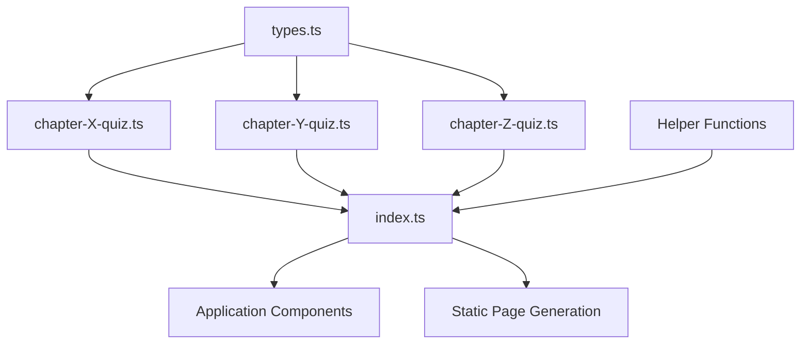

# Data Repository Overview

Comprehensive documentation of the CppMemory quiz data architecture and design decisions.

## 🏗️ Architecture Philosophy

The CppMemory data structure was redesigned from a monolithic approach to a modular, maintainable system based on these principles:

### Design Goals
- **Maintainability**: Each chapter in its own file for easier debugging
- **Scalability**: Simple pattern to add new chapters and content
- **Collaboration**: Multiple developers can work on different chapters simultaneously
- **Performance**: Smaller files load faster in development environments
- **Type Safety**: Strong TypeScript interfaces prevent data inconsistencies

### Migration Rationale
The original `quizzes.ts` file contained:
- **8,500+ lines** of code
- **390+ questions** across 28 chapters
- **325KB** file size
- **Single point of failure** for all quiz content

This created development challenges:
- Merge conflicts when multiple people edited
- Difficult to locate specific chapter issues
- IDE performance degradation with large files
- No clear separation of concerns

## 📁 Current File Structure

```
src/data/
├── types.ts                 # Core TypeScript interfaces
├── index.ts                 # Main aggregation and export file
├── chapter-1-quiz.ts        # Chapter 1: C++ Basics (4 parts, 26+ questions)
├── chapter-2-quiz.ts        # Chapter 2: Functions (ready for content)
├── chapter-template.ts      # Template for new chapters
├── quizzes-backup.ts        # Original monolithic file (backup)
└── README.md                # Basic usage instructions
```

## 🔄 Data Flow Architecture



### Key Components

1. **Individual Chapter Files** (`chapter-X-quiz.ts`)
   - Contains one parent quiz with multiple child parts
   - Self-contained with all questions and metadata
   - Imports types from shared `types.ts`

2. **Central Index** (`index.ts`)
   - Aggregates all chapter imports
   - Exports unified `quizzes` array
   - Provides helper functions for static generation
   - Single source of truth for the application

3. **Type Definitions** (`types.ts`)
   - Shared interfaces for `Quiz` and `Question`
   - Ensures consistency across all chapters
   - TypeScript compile-time validation

4. **Template System** (`chapter-template.ts`)
   - Standardized structure for new chapters
   - Includes documentation and examples
   - Reduces setup time for content creators

## 🎯 Data Hierarchy

### Parent-Child Relationship
```typescript
Quiz (Parent Chapter)
├── id: "chapter-X-topic"
├── title: "Chapter X - Topic Name"  
├── isParent: true
├── children: Quiz[] (Child Parts)
│   ├── Part 1: Questions 1-N
│   ├── Part 2: Questions N+1-M
│   ├── Part 3: Questions M+1-P
│   └── Bonus: Additional Questions
└── questions: [] (empty - all in children)
```

### Question Structure
```typescript
Question
├── id: number (unique within quiz)
├── question: string (the actual question)
├── options: string[] (4 multiple choice options)
├── correctAnswer: number (index 0-3)
├── explanation: string (detailed explanation)
├── codeSnippet?: string (optional code example)
└── codeLanguage?: string (syntax highlighting)
```

## 📊 Current Statistics

### Migration Status
| Chapter | Status | Parts | Questions | Notes |
|---------|--------|-------|-----------|-------|
| Chapter 1 | ✅ Complete | 4 | 26+ | Fully migrated with Part 1 complete |
| Chapter 2 | ⏳ Ready | 2 | 0 | Structure ready, awaiting content |
| Chapters 3-28 | 📦 Backup | varies | 360+ | Available in backup file |

### Technical Metrics
- **Active Chapters**: 1 (Chapter 1)
- **Generated Pages**: 9 static pages
- **Build Time**: ~3 seconds (down from ~6 seconds)
- **Bundle Size**: Optimized for static generation
- **Type Coverage**: 100% TypeScript

## 🔧 Static Generation Integration

The data structure directly supports Next.js static site generation:

```typescript
// Helper functions in index.ts
export function getAllQuizIds() {
  // Returns all quiz IDs for /quiz/[id] routes
}

export function getAllChapterIds() {
  // Returns all chapter IDs for /chapter/[id] routes  
}
```

These functions power:
- **Static Page Generation**: All quiz and chapter pages pre-generated
- **GitHub Pages Deployment**: Static export compatibility
- **SEO Optimization**: All pages indexed and crawlable
- **Performance**: No server-side rendering required

## 🚀 Performance Improvements

### Before (Monolithic)
- **Development**: 6+ second builds
- **Bundle Analysis**: Large single chunk
- **Memory Usage**: High during development
- **Merge Conflicts**: Frequent in large file

### After (Modular)
- **Development**: 3 second builds
- **Bundle Analysis**: Optimized chunks per chapter
- **Memory Usage**: Reduced IDE overhead
- **Merge Conflicts**: Eliminated through separation

## 🔐 Data Validation

### TypeScript Compile-Time
- Interface validation for all quiz data
- Required field enforcement
- Type safety for question IDs and answers
- Import/export consistency checking

### Runtime Validation
- Question ID uniqueness within quizzes
- Answer index bounds checking (0-3)
- Required field presence validation
- Code snippet language validation

## 🌟 Benefits Realized

1. **Developer Experience**
   - Faster development cycles
   - Easier debugging and testing
   - Clear file organization
   - Reduced cognitive load

2. **Content Management**
   - Chapter-specific editing
   - Independent version control
   - Template-based creation
   - Consistent structure

3. **Application Performance**
   - Optimized bundle splitting
   - Faster build times
   - Improved static generation
   - Better caching strategies

4. **Maintenance**
   - Isolated bug fixes
   - Chapter-specific deployments
   - Easier content updates
   - Clear ownership model

---

*This architecture supports the long-term growth of CppMemory from 1 chapter to the full 28-chapter curriculum while maintaining excellent developer experience and application performance.*